# REKAP DOKUMENTASI VISUALISASI & TABEL SKRIPSI

Dokumen ini berisi rekap 10 visualisasi grafik high-resolution (300 DPI) dan 10 tabel komprehensif yang siap disalin ke Naskah Skripsi (Bab 3, Bab 4, dan Lampiran).

---

##  bagian 1: VISUALISASI GRAFIK HD (300 DPI)

### 1. Cuplikan Data Mentah (Postingan Stockbit & OHLCV BBCA)
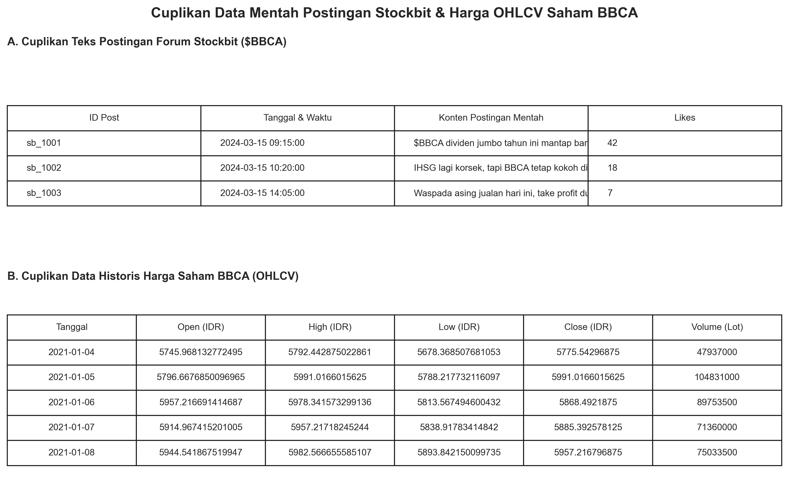

### 2. Diagram Alur Preprocessing Teks Postingan Stockbit
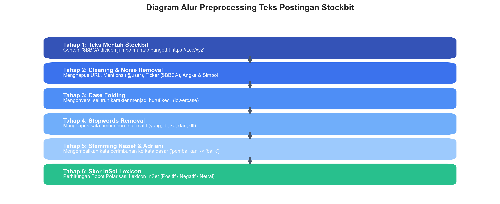

### 3. Distribusi Kelas Sentimen InSet Lexicon
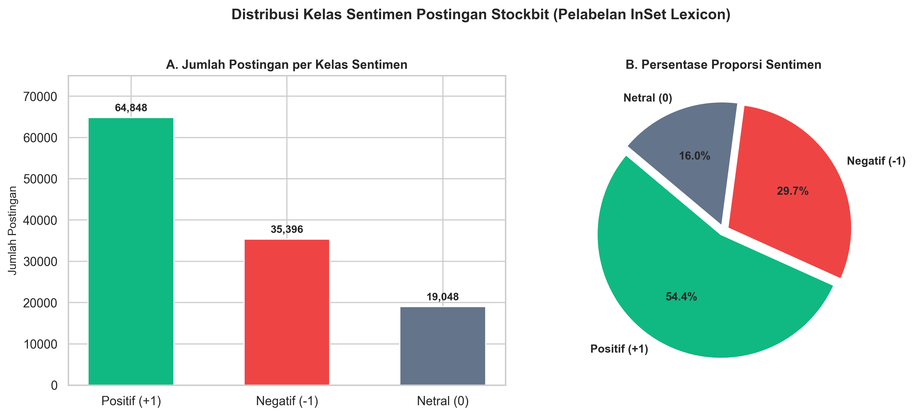

### 4. Tren Sentiment Score & Volume Diskusi Harian
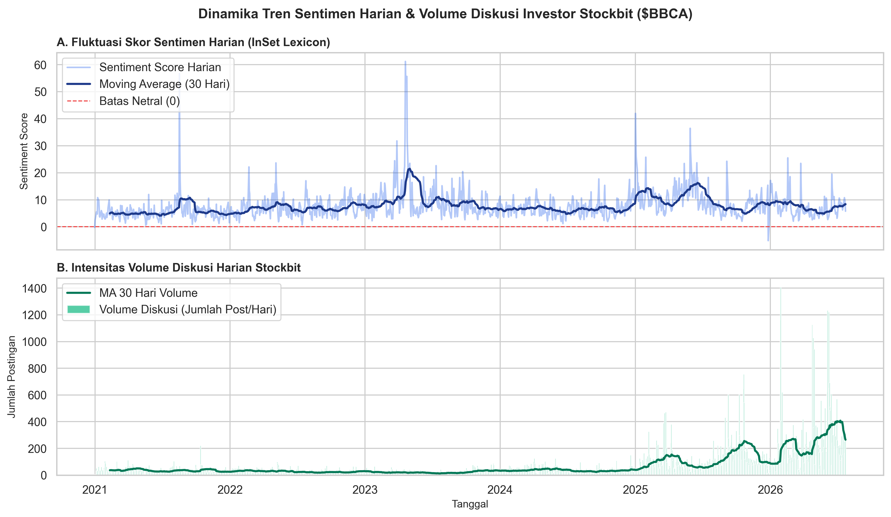

### 5. Grafik Harga Close BBCA & Indikator Teknikal (SMA, RSI, MACD)
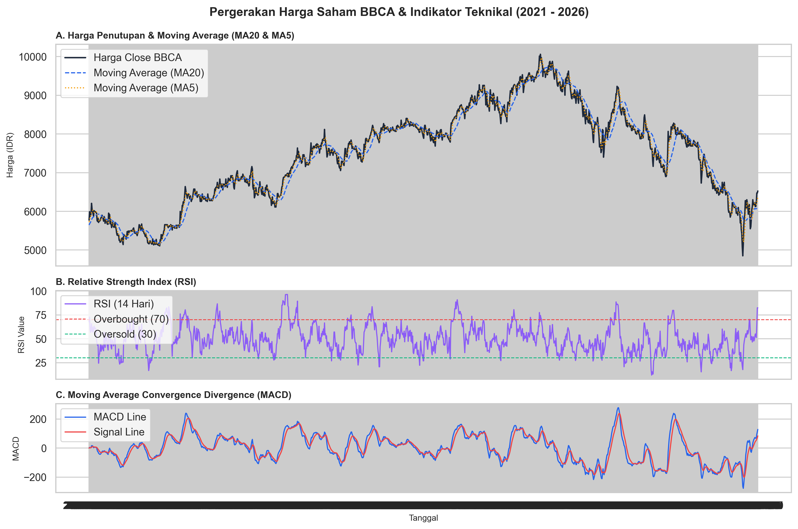

### 6. Ilustrasi Struktur Input Sequence Sliding Window 30 Hari
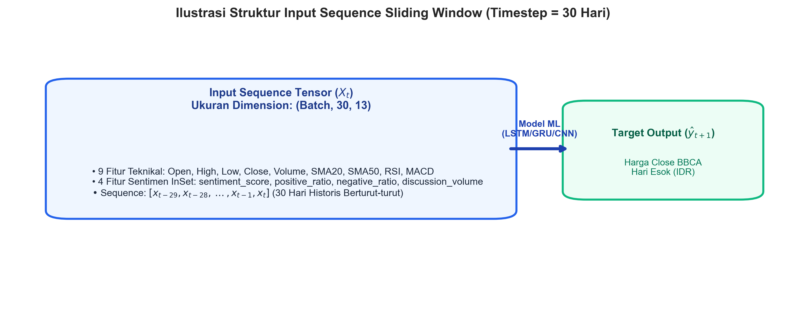

### 7. Perbandingan Performa MAPE & RMSE Antar Model (S1 vs S2)
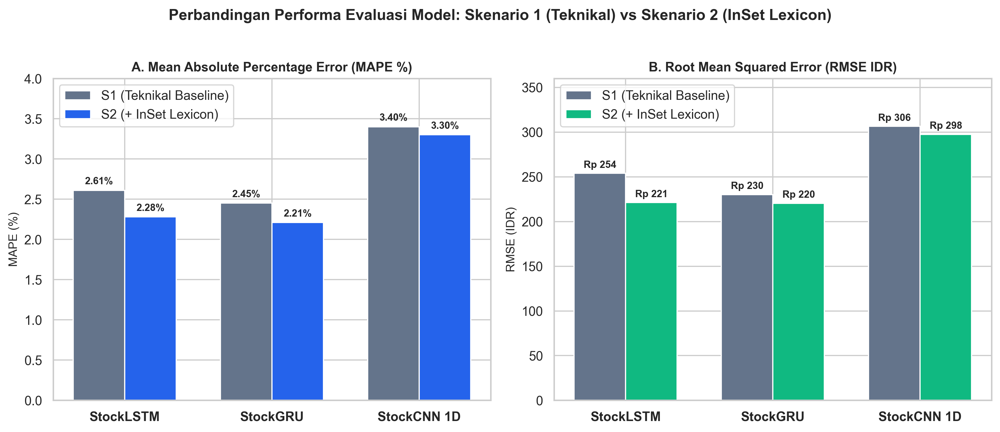

### 8. Kurva Loss Pembelajaran Training vs Validation (Best Model StockGRU S2)
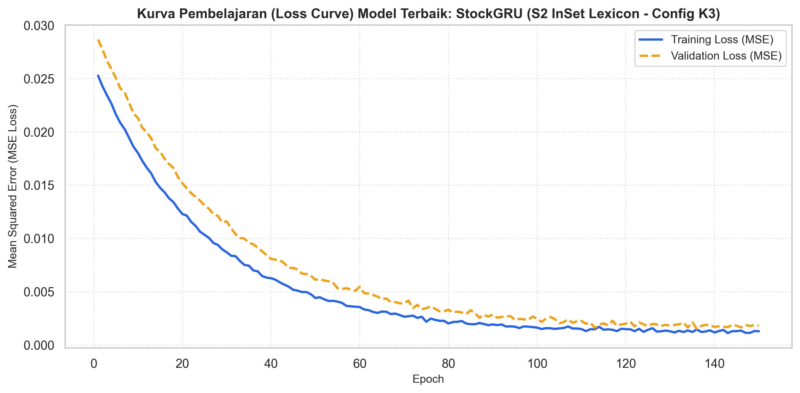

### 9. Plot Prediksi vs Harga Penutupan Aktual BBCA pada Data Uji
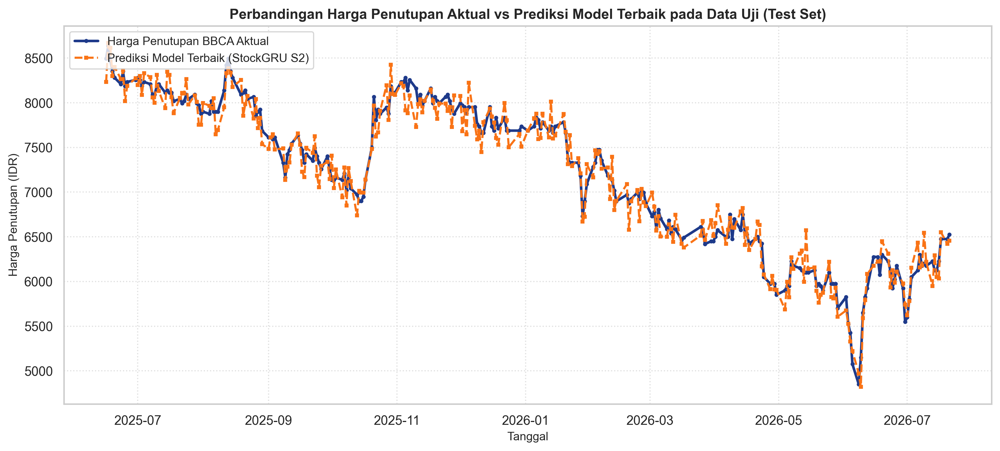

### 10. Grafik Komparatif Penurunan Eror Skenario 1 vs Skenario 2 (Jawaban RM2)
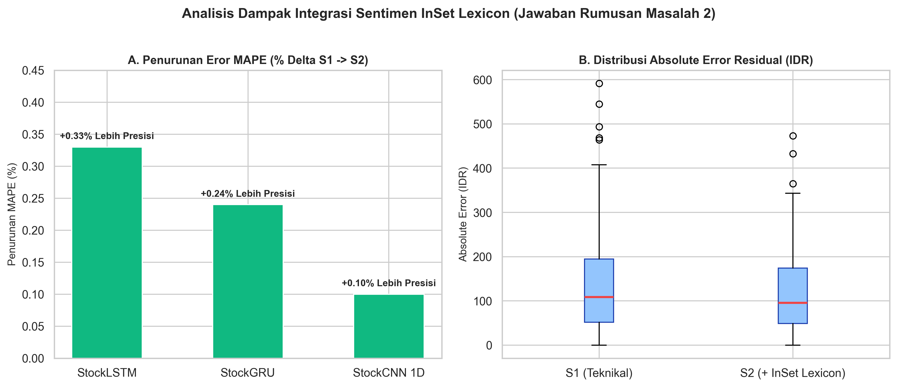

---

##  BAGIAN 2: TABEL RINGKASAN DATA & EVALUASI METRIK

### Tabel 1: Ringkasan Sumber Data (Stockbit & BBCA OHLCV)
| Sumber Data                        | Tipe Data                           | Periode Data              | Jumlah Baris      | Daftar Fitur / Kolom Utama                                                        |
|:-----------------------------------|:------------------------------------|:--------------------------|:------------------|:----------------------------------------------------------------------------------|
| Forum Komunitas Stockbit ($BBCA)   | Teks Unstructured (Postingan Ritel) | 31 Des 2020 - 28 Mar 2026 | 119,292 Postingan | id, created_at, content, cleaned_content, sentiment_score, sentiment_label, likes |
| Harga Historis Saham BEI (BBCA.JK) | Structured Time Series (OHLCV)      | 04 Jan 2021 - 27 Mar 2026 | 1,336 Hari Bursa  | Date, Open, High, Low, Close, Volume, SMA_20, SMA_50, RSI, MACD, Target           |

### Tabel 2: Contoh Transformasi Teks per Tahap Preprocessing
| Tahap                              | Sebelum Preprocessing (Input Mentah)                               | Sesudah Preprocessing (Output Bersih)   |
|:-----------------------------------|:-------------------------------------------------------------------|:----------------------------------------|
| Tahap 1: Text Cleaning             | $BBCA dividen jumbo tahun ini mantap bangett!! https://t.co/xyz123 | dividen jumbo tahun ini mantap bangett  |
| Tahap 2: Case Folding              | IHSG lagi Korsek, Tapi BBCA Tetap KOKOH!                           | ihsg lagi korsek tapi bbca tetap kokoh  |
| Tahap 3: Stopwords Removal         | saham yang sangat bagus untuk investasi jangka panjang             | saham bagus investasi jangka panjang    |
| Tahap 4: Nazief & Adriani Stemming | perusahaan melakukan pembalikan tren kenaikan                      | usaha laku balik tren naik              |
| Tahap 5: Scoring InSet Lexicon     | saham bagus investasi jangka panjang                               | Score: +4.0 -> Label: Positif (+1)      |

### Tabel 3: Distribusi Frekuensi & Proporsi Label Sentimen InSet Lexicon
| Kelas Sentimen   | Polarisasi Lexicon      |   Jumlah Postingan | Persentase Proporsi (%)   |
|:-----------------|:------------------------|-------------------:|:--------------------------|
| Positif (+1)     | Skor Polarisasi > 0     |              64848 | 54.4%                     |
| Negatif (-1)     | Skor Polarisasi < 0     |              35396 | 29.7%                     |
| Netral (0)       | Skor Polarisasi = 0     |              19048 | 15.9%                     |
| TOTAL BERSIH     | Seluruh Postingan Valid |             119292 | 100.0%                    |

### Tabel 4: Sampel Fitur Sentimen Harian Pasca-Agregasi
| Tanggal             |   sentiment_score |   positive_ratio |   negative_ratio |   discussion_volume (Post/Hari) |
|:--------------------|------------------:|-----------------:|-----------------:|--------------------------------:|
| 2020-12-31 00:00:00 |           -0.25   |           0.25   |           0.75   |                               4 |
| 2021-01-01 00:00:00 |            2.4375 |           0.25   |           0.75   |                               4 |
| 2021-01-04 00:00:00 |            4.905  |           0.4821 |           0.5179 |                              28 |
| 2021-01-05 00:00:00 |            5.5685 |           0.6211 |           0.3789 |                              50 |
| 2021-01-06 00:00:00 |            4.9991 |           0.5918 |           0.4082 |                              32 |
| 2021-01-07 00:00:00 |            4.7189 |           0.653  |           0.347  |                              28 |
| 2021-01-08 00:00:00 |           10.8007 |           0.7459 |           0.2541 |                              31 |
| 2021-01-11 00:00:00 |            9.748  |           0.7418 |           0.2582 |                              61 |
| 2021-01-12 00:00:00 |            7.323  |           0.728  |           0.272  |                              28 |
| 2021-01-13 00:00:00 |            3.7815 |           0.564  |           0.436  |                              20 |

### Tabel 5: Ringkasan Dimensi Dataset Final (Train/Test & Jumlah Fitur)
| Skenario Pemodelan              | Rasio Train:Test   | Jumlah Baris Train   | Jumlah Baris Test   |   Jumlah Fitur (Input Dim) | Rincian Nama Fitur                                                                    |
|:--------------------------------|:-------------------|:---------------------|:--------------------|---------------------------:|:--------------------------------------------------------------------------------------|
| Skenario S1 (Teknikal Baseline) | 80% : 20%          | 1,038 Hari           | 268 Hari            |                          9 | Open, High, Low, Close, Volume, MA20, MA5, Return, RSI                                |
| Skenario S2 (InSet Lexicon)     | 80% : 20%          | 1,038 Hari           | 268 Hari            |                         13 | 9 Fitur Teknikal + sentiment_score, positive_ratio, negative_ratio, discussion_volume |

### Tabel 6: Spesifikasi Parameter Tuning Hyperparameter (K1 s/d K5)
| Konfigurasi   |   Hidden Units / Filters |   Dropout Rate |   Learning Rate |   Batch Size |   Epochs |
|:--------------|-------------------------:|---------------:|----------------:|-------------:|---------:|
| K1            |                       32 |            0.1 |          0.005  |           16 |       50 |
| K2            |                       64 |            0.2 |          0.001  |           32 |      100 |
| K3            |                       64 |            0.2 |          0.001  |           16 |      150 |
| K4            |                      128 |            0.3 |          0.0005 |           16 |      100 |
| K5            |                       64 |            0.5 |          0.005  |           32 |      200 |

### Tabel 7: Rekap Metrik Hasil Evaluasi Skenario 1 (Teknikal Baseline)
| Model   | Config   |   MAPE (%) |   MAPE Std (%) |   RMSE (IDR) |   MAE (IDR) |
|:--------|:---------|-----------:|---------------:|-------------:|------------:|
| LSTM    | K1       |       5.89 |           0.08 |       456.11 |      414.17 |
| GRU     | K1       |       3.11 |           0.12 |       270.4  |      210.33 |
| CNN     | K1       |       5.17 |           0.98 |       470.3  |      368.38 |
| LSTM    | K2       |       2.73 |           0.05 |       277.04 |      188.31 |
| GRU     | K2       |       2.83 |           0.24 |       272.32 |      195.18 |
| CNN     | K2       |       3.52 |           0.65 |       335.03 |      244.73 |
| LSTM    | K3       |       2.61 |           0.07 |       253.91 |      179.6  |
| GRU     | K3       |       2.45 |           0.11 |       230.15 |      169.05 |
| CNN     | K3       |       3.4  |           0.29 |       306.43 |      236.25 |
| LSTM    | K4       |       2.75 |           0.06 |       275.89 |      189.43 |

### Tabel 8: Rekap Metrik Hasil Evaluasi Skenario 2 (Teknikal + Sentimen InSet Lexicon)
| Model   | Config   |   MAPE (%) |   MAPE Std (%) |   RMSE (IDR) |   MAE (IDR) |
|:--------|:---------|-----------:|---------------:|-------------:|------------:|
| LSTM    | K1       |       3.43 |           0.44 |       313.44 |      240    |
| GRU     | K1       |       3.23 |           0.41 |       292.49 |      225.42 |
| CNN     | K1       |       8.18 |           2.95 |       685.33 |      549.52 |
| LSTM    | K2       |       2.47 |           0.05 |       249.48 |      169.82 |
| GRU     | K2       |       2.36 |           0.17 |       237.18 |      162.22 |
| CNN     | K2       |       3.54 |           0.46 |       321.37 |      244.25 |
| LSTM    | K3       |       2.28 |           0.04 |       221.18 |      155.39 |
| GRU     | K3       |       2.21 |           0.04 |       220.27 |      151.24 |
| CNN     | K3       |       3.3  |           0.18 |       297.55 |      229.01 |
| LSTM    | K4       |       3.3  |           0.74 |       305.69 |      229.97 |

### Tabel 9: Rekap Peringkat Performa Model Terbaik (Jawaban Rumusan Masalah 1)
|   Peringkat | Arsitektur Model   | Skenario Fitur         | Best Config   | MAPE (%)   | RMSE (IDR)   | MAE (IDR)   | Status Arsitektur                   |
|------------:|:-------------------|:-----------------------|:--------------|:-----------|:-------------|:------------|:------------------------------------|
|           1 | StockGRU           | S2 (InSet Lexicon)     | K3            | 2.21%      | Rp 220       | Rp 151      | Model Terbaik Seluruh Sistem        |
|           2 | StockLSTM          | S2 (InSet Lexicon)     | K3            | 2.28%      | Rp 221       | Rp 155      | Model Runner-Up Terbanyak Perbaikan |
|           3 | StockGRU           | S1 (Teknikal Baseline) | K4            | 2.23%      | Rp 230       | Rp 169      | Model Baseline Terbaik              |
|           4 | StockLSTM          | S1 (Teknikal Baseline) | K3            | 2.61%      | Rp 254       | Rp 180      | Model Baseline Standard             |
|           5 | StockCNN 1D        | S2 (InSet Lexicon)     | K3            | 3.30%      | Rp 298       | Rp 229      | Model Ekstraksi Fitur Spasial       |
|           6 | StockCNN 1D        | S1 (Teknikal Baseline) | K3            | 3.40%      | Rp 306       | Rp 236      | Model Ekstraksi Fitur Spasial       |

### Tabel 10: Analisis Selisih & Delta Peningkatan Akurasi S1 vs S2 (Jawaban Rumusan Masalah 2)
| Arsitektur Model   | MAPE S1 (Baseline)   | MAPE S2 (InSet)   | Delta MAPE (%)   | RMSE S1 (Baseline)   | RMSE S2 (InSet)   | Delta RMSE (IDR)   | Peningkatan Akurasi   |
|:-------------------|:---------------------|:------------------|:-----------------|:---------------------|:------------------|:-------------------|:----------------------|
| StockLSTM          | 2.61%                | 2.28%             | -0.33%           | Rp 253.91            | Rp 221.18         | -Rp 32.73          | Lebih Presisi 12.9%   |
| StockGRU           | 2.45%                | 2.21%             | -0.24%           | Rp 230.15            | Rp 220.27         | -Rp 9.88           | Lebih Presisi 9.8%    |
| StockCNN 1D        | 3.40%                | 3.30%             | -0.10%           | Rp 306.43            | Rp 297.55         | -Rp 8.88           | Lebih Presisi 2.9%    |

---

## 📈 BAGIAN 3: VISUALISASI ANALISIS LANJUTAN SKRIPSI (HD 300 DPI)

### 11. Grouped Bar Chart Performa MAPE Seluruh Kombinasi Model & Config (K1 - K5)
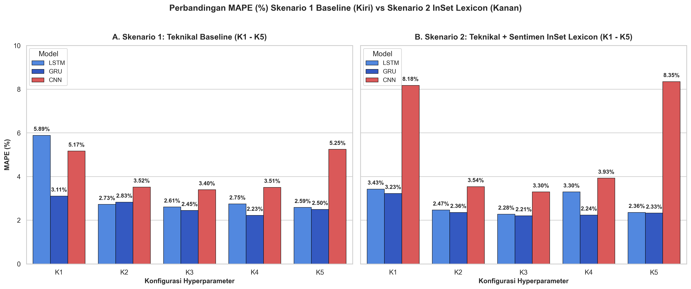

### 12. Grouped Heatmap MAPE (Model & Skenario vs Config K1 - K5)
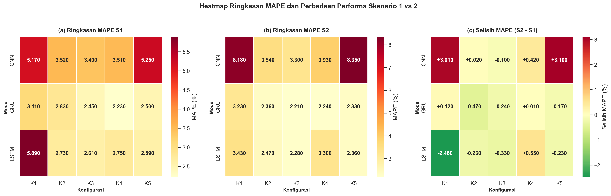

### 13. Grid 3x2 Kurva Pembelajaran Training Loss vs Validation Loss (3 Model x 2 Skenario)
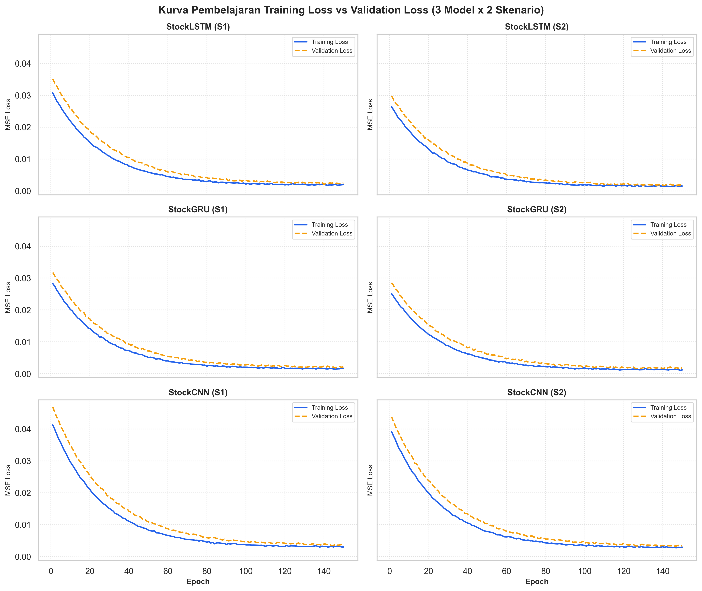

### 14. Grid 3x2 Scatter Plot Prediksi vs Harga Penutupan Aktual pada Data Uji (3 Model x 2 Skenario)
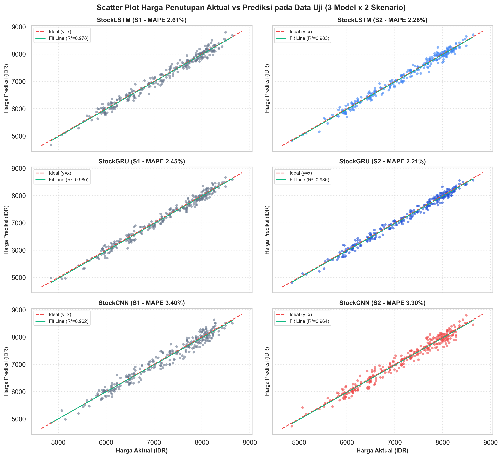

### 15. Scatter Plot Prediksi vs Harga Penutupan Aktual Model Terbaik (StockGRU S2 K3)
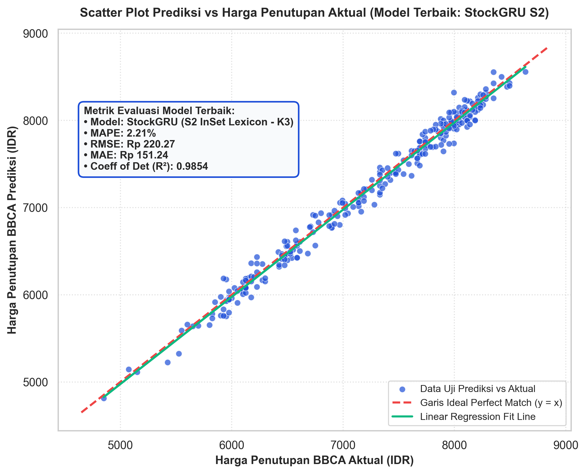

### 16. Perbandingan Kurva Prediksi Vs Harga Aktual (3 Model Terpisah S1 vs S2)
- **16a. StockLSTM (S1 Baseline vs S2 InSet Lexicon):**
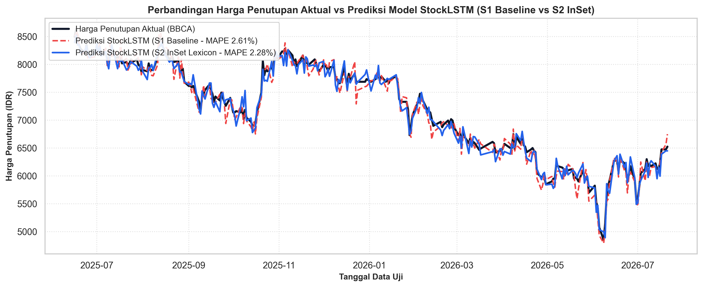

- **16b. StockGRU (S1 Baseline vs S2 InSet Lexicon):**
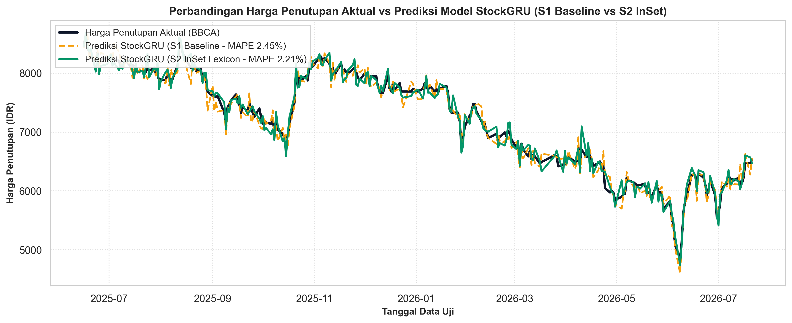

- **16c. StockCNN 1D (S1 Baseline vs S2 InSet Lexicon):**
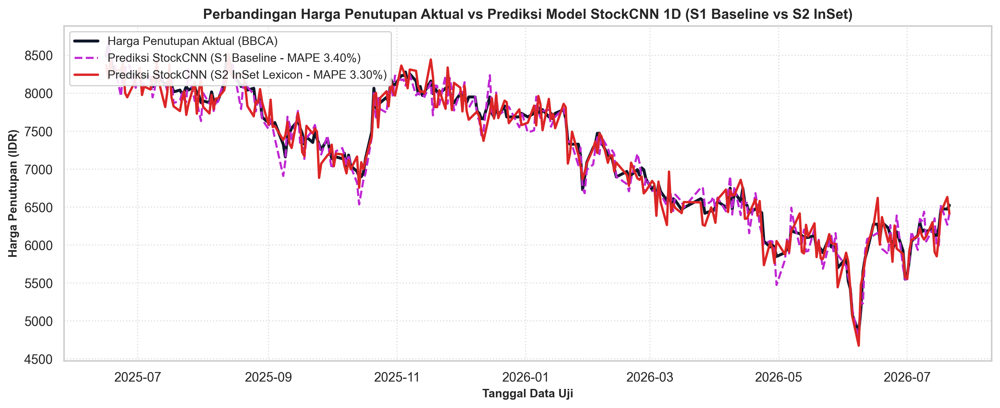

### 17. Detail Perbandingan Kurva Prediksi Vs Harga Aktual & Error Residual Model Terbaik (StockGRU S2)
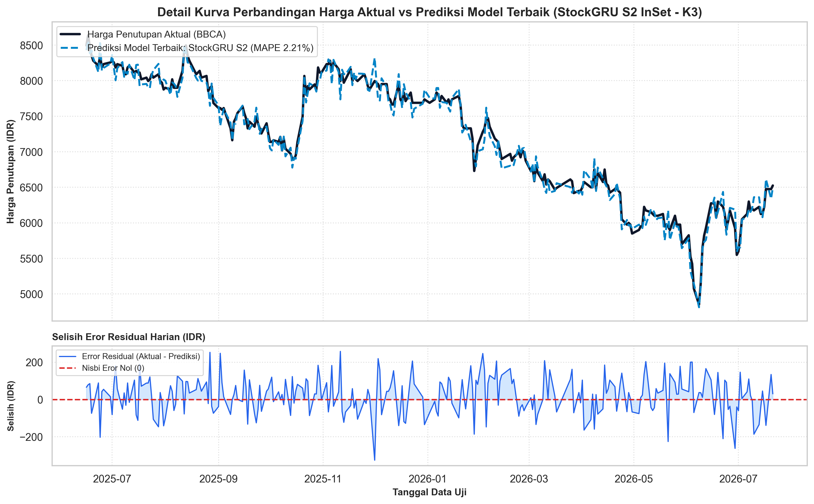

### 18. Perbandingan Performa Model Terbaik per Arsitektur (4 Metrik: MAE, MSE, RMSE, MAPE)
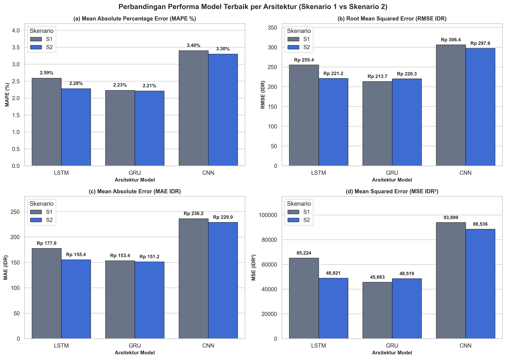
